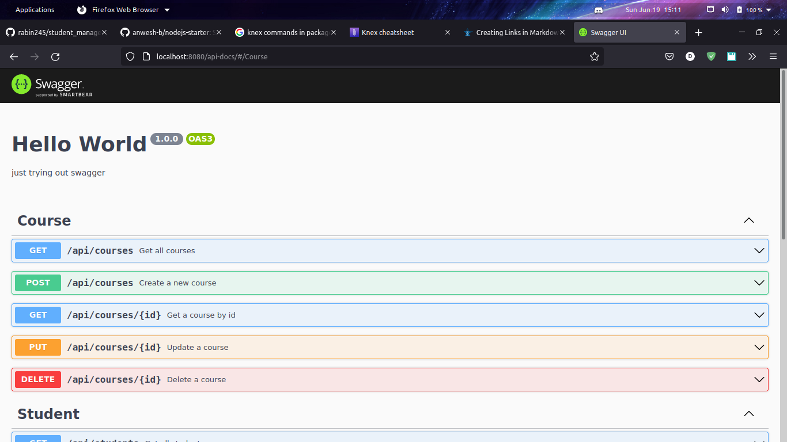
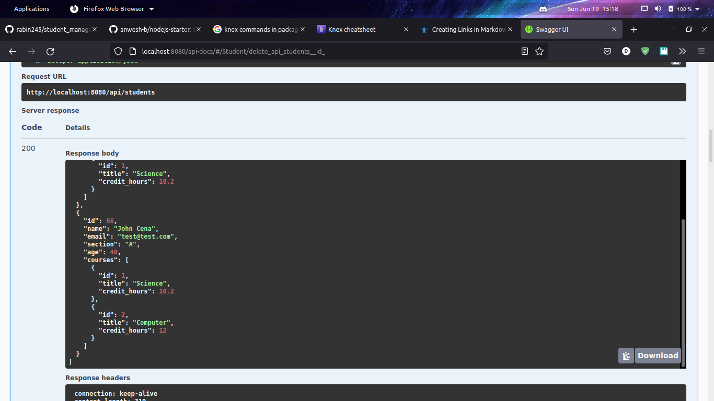

# Student Management API

Simple student management api using [Knex](http://knexjs.org/) with Postgresql db

## Installation

- Create `.env` file
- `npm i`
- `npm run migrate`
- `npm run seed`
- `npm run start`

## Screenshots

  
  
